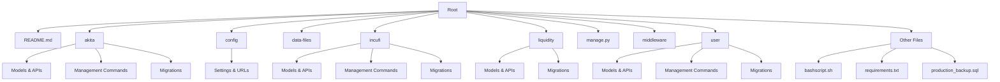

# Backend Project Overview 🖥️

## Project Structure 🏗️

The backend of the HODL project is built using Django, a high-level Python web framework. Here's an overview of the project structure:



## Key Components 🔑

### 1. Django Apps

#### 1.1 Akita App
- **Purpose**: Manages NFT-related functionalities
- **Key Files**:
  - `models.py`: Defines NFT, Price models
  - `apis.py`: API endpoints for NFT operations
  - `management/commands/`: Custom management commands
    - `distribute_commission.py`
    - `distribute_gift.py`
    - `import_nfts.py`

#### 1.2 Incufi App
- **Purpose**: Handles staking and commission operations
- **Key Files**:
  - `models.py`: Defines Stake, Commission models
  - `apis.py`: API endpoints for staking operations
  - `management/commands/`:
    - `convert_stake_to_nft.py`
    - `double_earning.py`
    - `import_bonus.py`
    - `import_stakes.py`

#### 1.3 Liquidity App
- **Purpose**: Manages liquidity-related functionalities
- **Key Files**:
  - `models.py`: Defines liquidity models
  - `apis.py`: API endpoints for liquidity operations
  - `utils.py`: Utility functions for liquidity calculations

#### 1.4 User App
- **Purpose**: Handles user management and authentication
- **Key Files**:
  - `models.py`: Defines custom User model and UserProfile
  - `apis.py`: API endpoints for user operations
  - `management/commands/`:
    - `backup_db.py`
    - `change_parent.py`
    - `import_users.py`

### 2. Configuration

The `config` directory contains project-wide settings:
- `settings.py`: Django project settings
- `urls.py`: Main URL routing configuration

### 3. Middleware

Custom middleware in `middleware/restrict_ip.py` for IP restriction functionality.

### 4. Data Files

The `data-files` directory contains various CSV files, likely used for data import operations:
- NFT data
- Gift distribution data
- User data
- Stake data

### 5. Management Commands

Each app has its own set of management commands for various operations:
- Distributing commissions and gifts
- Importing NFTs, stakes, and users
- Converting stakes to NFTs
- Database backup

### 6. Database Migrations

Each app contains its own migrations directory to manage database schema changes over time.

## Key Features 🌟

1. **NFT Management**: Creation, distribution, and tracking of NFTs
2. **Staking System**: User staking functionality with rewards
3. **Commission Distribution**: Automated commission calculation and distribution
4. **Liquidity Operations**: Managing liquidity pools and related calculations
5. **User Management**: Custom user model with profiles and authentication
6. **Data Import/Export**: Various commands for importing and exporting data
7. **Database Backup**: Automated database backup functionality

## Tech Stack 🛠️

- **Framework**: Django (Python)
- **Database**: PostgreSQL (inferred from production backup file)
- **API**: Django Rest Framework (inferred from `apis.py` files)
- **Task Scheduling**: Likely uses Celery or Django's built-in cron (inferred from management commands)

## Getting Started 🚀

1. Clone the repository
2. Install dependencies:
   ```bash
   pip install -r requirements.txt
   ```
3. Set up the database:
   ```bash
   python manage.py migrate
   ```
4. Run the development server:
   ```bash
   python manage.py runserver
   ```

> 📘 **Note**: Make sure to configure your environment variables and database settings before running the project.

## Best Practices Checklist ✅

- [ ] Use virtual environments for development
- [ ] Keep `requirements.txt` updated
- [ ] Run tests before committing changes
- [ ] Follow PEP 8 style guide for Python code
- [ ] Document new API endpoints and models
- [ ] Use Django's ORM for database operations
- [ ] Regularly backup production data

## Need Help? 🆘

- 📚 Refer to the project's `README.md` for detailed setup instructions
- 👥 Contact the backend team lead for access issues or architectural questions
- 💬 Use the project's issue tracker for bug reports and feature requests