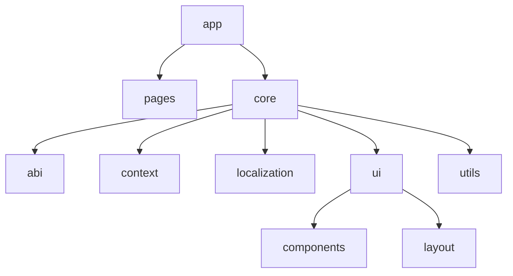

# Frontend Overview 🖥️

Welcome to the frontend documentation of the HODL Project! This overview will help you understand the structure and components of our frontend application.

## Project Structure 🏗️

Our frontend is built using Next.js, a React framework that enables server-side rendering and generating static websites. Here's a high-level overview of our project structure:



## Pages 📄

Our application consists of several key pages, each serving a specific purpose:

| Page | Description | Location |
|------|-------------|----------|
| Dashboard | Main user interface showing key metrics and actions | `/app/dashboard/page.tsx` |
| My NFTs | Displays user's owned NFTs and related information | `/app/my-nfts/page.tsx` |
| Stake | Interface for staking tokens | `/app/stake/page.tsx` |
| Swap | Token swapping functionality | `/app/swap/page.tsx` |
| Team | Shows user's team structure and referrals | `/app/team/page.tsx` |
| Bonus | Displays user's bonus information | `/app/bonus/page.tsx` |
| Complete Profile | Form for users to complete their profile information | `/app/complete-profile/page.tsx` |
| Register | User registration page | `/app/register/page.tsx` |
| Projects | Overview of available or ongoing projects | `/app/projects/page.tsx` |
| Withdraw History | Shows user's withdrawal history | `/app/withdraw-history/page.tsx` |

## Core Components 🧱

The `core` directory contains essential utilities and configurations:

- **abi**: Contains ABI (Application Binary Interface) files for smart contract interaction.
- **context**: Manages application-wide state and configurations.
- **localization**: Handles multi-language support.
- **ui**: Contains reusable UI components and layouts.
- **utils**: Utility functions and helpers.

## Key Features ✨

1. **Responsive Design**: Our UI adapts to various screen sizes for optimal user experience.
2. **Localization**: Support for multiple languages (English and Korean).
3. **Web3 Integration**: Seamless interaction with blockchain functionalities.
4. **State Management**: Efficient state management using React context.

## Getting Started 🚀

To set up the frontend development environment:

1. Clone the repository
2. Install dependencies:
   ```bash
   npm install
   ```
3. Run the development server:
   ```bash
   npm run dev
   ```
4. Open [http://localhost:3000](http://localhost:3000) in your browser

## Need Help? 🆘

If you encounter any issues or have questions:

- Check our [Troubleshooting Guide](/troubleshooting/common-issues)
- Refer to the [FAQ](/troubleshooting/faq)
- Contact our development team at [support@hodlproject.com](mailto:support@hodlproject.com)

Happy coding! 🎉