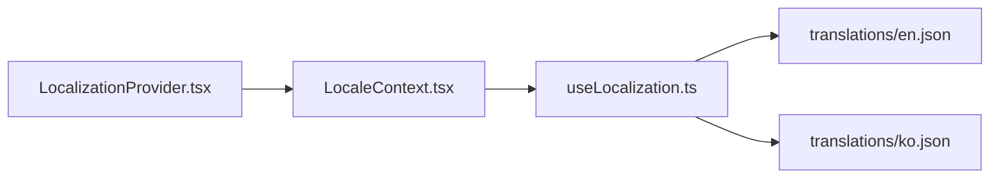
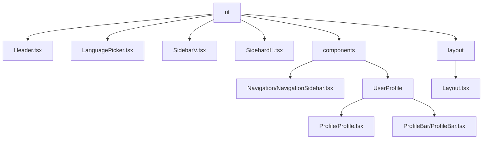

# Frontend Project Structure 🏗️

## Complete Project Tree 🌳

```mermaid
graph TD
    A[Root] --> B[README.md]
    A --> C[app]
    A --> D[core]
    A --> E[Configuration Files]
    A --> F[bashscript.sh]
    
    C --> G[bonus]
    C --> H[complete-profile]
    C --> I[dashboard]
    C --> J[my-nfts]
    C --> K[projects]
    C --> L[register]
    C --> M[stake]
    C --> N[swap]
    C --> O[team]
    C --> P[withdraw-history]
    C --> Q[favicon.ico]
    C --> R[global.css]
    C --> S[layout.tsx]
    C --> T[page.tsx]
    C --> U[signin.module.css]
    
    D --> V[abi]
    D --> W[context]
    D --> X[localization]
    D --> Y[ui]
    D --> Z[utils]
    
    E --> AA[next-env.d.ts]
    E --> AB[next.config.mjs]
    E --> AC[package-lock.json]
    E --> AD[package.json]
    E --> AE[tsconfig.json]
    E --> AF[tree.txt]

    click C "https://nextjs.org/docs/app" "Learn about Next.js app directory"
    click D "https://react.dev/learn/passing-data-deeply-with-context" "Learn about React Context"
    click V "https://docs.ethers.org/v5/api/utils/abi/" "Learn about Ethereum ABIs"
    click X "https://react.i18next.com/" "Learn about i18next for React"
```



## Key Components 🔑

### 1. Root Directory Files
- `README.md`: Project documentation
- `bashscript.sh`: Shell script for automation tasks

### 2. `app` Directory
Contains page components and global styles. Each subdirectory typically represents a route.

| Component | Purpose | Associated Files |
|-----------|---------|------------------|
| `bonus` | 🎁 Bonus/rewards page | `page.tsx` |
| `complete-profile` | 👤 Profile completion | `page.tsx` |
| `dashboard` | 📊 Main user dashboard | `page.tsx`, `dashboard.module.css` |
| `my-nfts` | 🖼️ Display user's NFTs | `page.tsx`, `my-nfts.module.css` |
| `projects` | 📁 Projects overview | `page.tsx`, `projects.module.css` |
| `register` | 📝 User registration | `page.tsx`, `register.module.css` |
| `stake` | 💰 Staking functionality | `page.tsx`, `stake.module.css` |
| `swap` | 🔄 Token swap interface | `page.tsx`, `swap.module.css` |
| `team` | 👥 Team/referral info | `page.tsx`, `team.module.css`, `referralTree.tsx` |
| `withdraw-history` | 📜 Withdrawal records | `page.tsx`, `withdraw-history.module.css` |

Global files:
- `favicon.ico`: Site favicon
- `global.css`: Global styles
- `layout.tsx`: Root layout component
- `page.tsx`: Root page component
- `signin.module.css`: Styles for sign-in functionality

### 3. `core` Directory
Houses essential utilities and configurations.

#### 3.1 `abi` Subdirectory
JSON files defining smart contract interfaces:
```
ERC20_TOKEN.json
incufi.json
liquidity.json
nft.json
nft2.json
purchase.json
swap.json
```

#### 3.2 `context` Subdirectory
Manages app-wide state:
- `loader.ts`: Loading state management
- `web3modal.tsx`: Web3 connection modal

#### 3.3 `localization` Subdirectory
Handles internationalization:



#### 3.4 `ui` Subdirectory
Reusable UI components:



#### 3.5 `utils` Subdirectory
Utility functions:
- `axiosClient.ts`: API calls
- `constant.ts`: App constants
- `contract.ts`: Smart contract interactions
- `utils.ts`: General utilities

### 4. Configuration Files
- `next-env.d.ts`: TypeScript declarations for Next.js
- `next.config.mjs`: Next.js configuration
- `package-lock.json`: Locked dependencies
- `package.json`: Project dependencies and scripts
- `tsconfig.json`: TypeScript configuration
- `tree.txt`: Project structure text file

## Quick Start Guide 🚀

1. Clone the repo
2. Install dependencies:
   ```bash
   npm install
   ```
3. Run development server:
   ```bash
   npm run dev
   ```

> 📘 **Tip**: Use `npm run build` for production builds.

## Best Practices Checklist ✅

- [ ] Follow established folder structure for new features
- [ ] Use TypeScript for type safety
- [ ] Utilize core utilities and components
- [ ] Keep components modular and reusable
- [ ] Update translations when adding new text
- [ ] Test across different locales and devices

## Need Help? 🆘

- 📚 [Troubleshooting Guide](../troubleshooting/common-issues.md)
- 👥 Contact frontend team lead
- 💬 Post in project communication channel